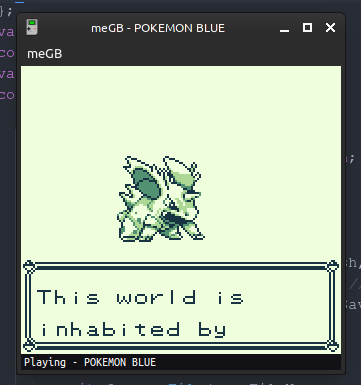
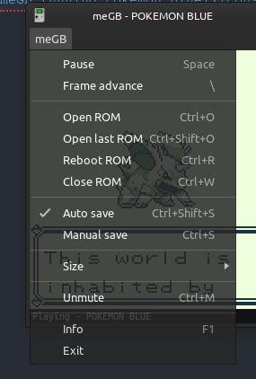

&nbsp;&nbsp;

Gameboy emulator written in Node.js
---
(almost) Fully customizable `config.json` file. Able to change menu button labels, keybinds, theme, audio, and more.\
Has Discord RPC support to show information like what ROM you're playing.\
Audio works, but awful to listen to so muted by default.

- [x] Save files
- [ ] Make framerate display actually work
- [ ] Better performance
- [ ] Fix audio (stop clicks)
- [ ] Export/import save (already possible manually)
- [ ] Save states
- [ ] Movie recording

Screenshots:

